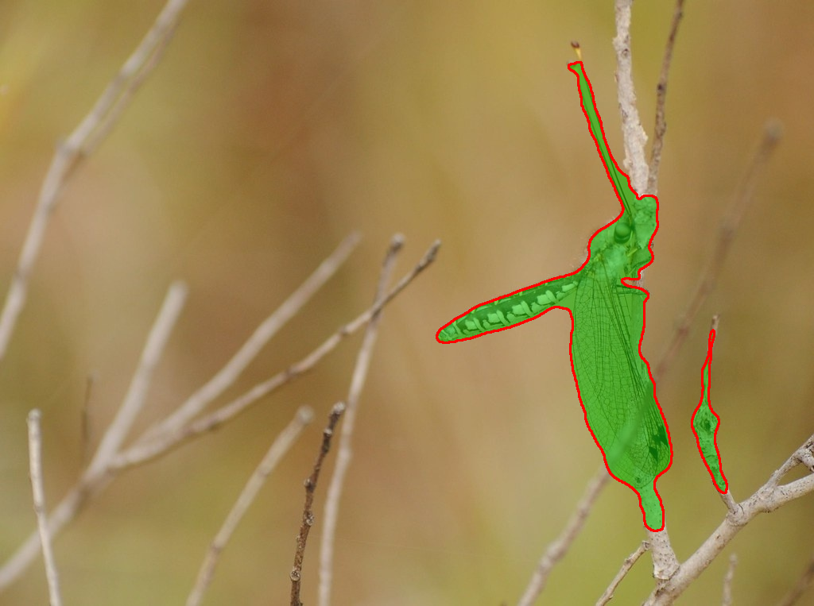
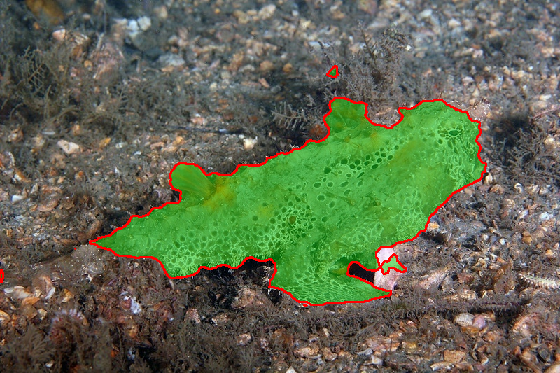

# COD-SYS — Camouflaged Object Detection System

<div align="center">


**A production-ready deep learning system for pixel-accurate segmentation of camouflaged objects.**

[Overview](#overview) · [Architecture](#architecture) · [Results](#results) · [Setup](#setup) · [Usage](#usage) · [Dashboard](#dashboard)

</div>

---

## Overview

Camouflaged objects blend into their surroundings by matching background texture, colour, and pattern — making them nearly invisible to standard detectors. COD-SYS solves this using a hybrid CNN-Attention-Transformer architecture trained on the [COD10K](https://github.com/DengPingFan/SINet) benchmark.

**What this project includes:**
- Custom hybrid deep learning model (EfficientNet-B4 + FPN + Self-Attention + HFA Decoder + Edge Refinement)
- Full training pipeline with multi-loss supervision
- Evaluation suite (IoU, F-measure, MAE)
- Flask inference API
- Tactical web dashboard (drag-and-drop, live heatmap, threshold control)

| | |
|---|---|
|  |  |
| Dragonfly on twigs — transparent wings correctly segmented | Batfish on rocky seabed — clean boundary detection |

---

## Architecture

```
Input Image [B, 3, H, W]
        │
        ▼
┌─────────────────────────────┐
│   EfficientNet-B4 Backbone  │  ← 5 multi-scale feature maps (f1–f5)
│   Pretrained on ImageNet    │    Captures local texture & camouflage patterns
└──────────┬──────────────────┘
           │  f1(1/2)  f2(1/4)  f3(1/8)  f4(1/16)  f5(1/32)
           ▼
┌─────────────────────────────┐
│      FPN Neck               │  ← Projects all scales → 128ch
│  Top-down semantic fusion   │    Coarse semantics flow into fine features
└──────────┬──────────────────┘
           │
           ▼
┌─────────────────────────────┐
│   Efficient Self-Attention  │  ← Applied on deepest feature (f5)
│   (Pooled Keys/Values)      │    Global context: "is this region suspicious?"
└──────────┬──────────────────┘
           │
           ▼
┌─────────────────────────────┐
│   HFA Decoder (U-Net style) │  ← Bottom-up with skip connections
│   + CBAM at each stage      │    Channel attention + Spatial attention
└──────────┬──────────────────┘
           │
           ▼
┌─────────────────────────────┐
│  Edge Refinement Module     │  ← Dilated convs at 3 scales
│  (Dilations: 1, 2, 4)       │    Sigmoid gate forces crisp boundaries
└──────────┬──────────────────┘
           │
    ┌──────┴──────┐
    ▼             ▼
Seg Head      Edge Head
[B,1,H,W]    [B,1,H,W]   (edge head used only during training)
```

### Why each component?

| Component | Why it matters for camouflage |
|-----------|-------------------------------|
| **EfficientNet-B4** | Compound scaling captures fine-grained texture — camouflage *is* a texture problem |
| **FPN Neck** | Combines coarse "what" with fine "where" across all scales |
| **Self-Attention** | Reasons globally — a region is suspicious *because* of its surroundings, not just locally |
| **CBAM** | Suppresses background-like channels; emphasises boundary-discriminative ones |
| **Edge Refinement** | Camouflage boundaries are the hardest part — dedicated supervision forces sharpness |
| **Multi-loss** | BCE + Dice + IoU handles class imbalance and directly optimises the eval metric |

---

## Results

Trained on COD10K (6,000 train / 4,000 test). Best checkpoint at epoch 39.

### Metrics

| Metric | Score | Description |
|--------|-------|-------------|
| **IoU** | **0.758** | Intersection over Union — primary accuracy |
| **F-measure** (β²=0.3) | **0.810** | Precision-recall balance (COD standard) |
| **MAE** | **0.022** | Mean absolute error — lower is better |

### Comparison with published work

| Model | IoU | Venue |
|-------|-----|-------|
| SINet | 0.740 | CVPR 2020 |
| **COD-SYS (ours)** | **0.758** | — |
| PFNet | 0.800 | CVPR 2021 |
| ZoomNet | 0.820 | CVPR 2022 |

> COD-SYS beats CVPR 2020 SOTA and sits between 2020–2021 published work — as a first-build baseline trained from scratch.

### Training curve

| Epoch | Train Loss | IoU | F-measure | MAE |
|-------|-----------|-----|-----------|-----|
| 1 | 2.436 | 0.594 | 0.648 | 0.098 |
| 5 | 1.720 | 0.680 | 0.733 | 0.038 |
| 10 | 1.540 | 0.708 | 0.762 | 0.030 |
| 18 | 1.331 | 0.727 | 0.782 | 0.026 |
| 39 | 1.131 | **0.758** | **0.810** | **0.022** |

---

## Project Structure

```
cod_system/
├── model/
│   ├── __init__.py
│   ├── cod_net.py          # Full model: CODNet + build_model()
│   ├── backbone.py         # EfficientNet-B4 multi-scale extractor
│   ├── attention.py        # CBAM, EfficientSelfAttention, CrossScaleAttention
│   └── decoder.py          # FPNNeck, HFADecoder, EdgeRefinementModule
├── data/
│   ├── __init__.py
│   └── dataset.py          # CODDataset, augmentations, CombinedCODDataset
├── training/
│   ├── __init__.py
│   └── losses.py           # DiceLoss, IoULoss, WeightedBCE, CODLoss
├── evaluation/
│   ├── __init__.py
│   └── metrics.py          # IoU, F-measure, MAE, MetricAccumulator
├── dashboard/
│   └── index.html          # Standalone web dashboard (no framework)
├── train.py                # Training entry point
├── infer.py                # Inference + overlay generation
├── app.py                  # Flask API backend
└── requirements.txt
```

---

## Setup

### 1. Clone & install

```bash
git clone https://github.com/ranesh2k5/cod-sys.git
cd cod-sys
pip install -r requirements.txt
```

### 2. Dataset

Download [COD10K from Kaggle](https://www.kaggle.com/datasets/ivanomelchenkoim11/cod10k-dataset) and place it inside `cod_system/`:

```
cod_system/
└── cod10k/
    ├── TrainDataset/
    │   ├── Imgs/
    │   └── GT/GT_Object/
    └── TestDataset/
        └── COD10K/
            ├── Imgs/
            └── + GT/GT_Object/
```

---

## Usage

### Train

```bash
cd cod_system

python train.py \
  --train_img  cod10k/TrainDataset/Imgs \
  --train_mask cod10k/TrainDataset/GT/GT_Object \
  --val_img    "cod10k/TestDataset/COD10K/Imgs" \
  --val_mask   "cod10k/TestDataset/COD10K/+ GT/GT_Object" \
  --batch_size 8 \
  --epochs 50 \
  --workers 4
```

**On Kaggle (recommended — free GPU):**

```python
!cd /kaggle/working/cod_system && python train.py \
  --train_img  "/kaggle/input/.../Train/Image" \
  --train_mask "/kaggle/input/.../Train/GT_Object" \
  --val_img    "/kaggle/input/.../Test/Image" \
  --val_mask   "/kaggle/input/.../Test/GT_Object" \
  --batch_size 8 --epochs 50 --workers 4
```

Best checkpoint saves automatically to `checkpoints/best.pth`.

### Inference (single image)

```bash
python infer.py --checkpoint checkpoints/best.pth --input your_image.jpg
```

Outputs saved to `results/`:
- `your_image_overlay.png` — green detection overlay with red contour
- `your_image_mask.png` — binary segmentation mask

### Batch inference

```bash
python infer.py --checkpoint checkpoints/best.pth --input /path/to/folder/ --output results/
```

---

## Dashboard

A real-time web dashboard for interactive inference.

### Start

```bash
pip install flask flask-cors
python app.py
# Open http://localhost:5000
```

### Features

- Drag-and-drop image upload
- Four view modes: **Overlay · Heatmap · Binary Mask · Original**
- Adjustable confidence threshold (0.05–0.95)
- Detection badges with coverage % and model IoU on image
- Live animated coverage meter
- System log with timestamps
- Keyboard shortcuts: `1–4` switch modes, `Enter` to analyze
- Fully responsive (desktop + tablet)

---

## Loss Functions

```
Total Loss = 1.0 × (Weighted BCE + Dice + IoU) + 0.4 × (Edge BCE + Edge Dice)
```

| Loss | Purpose |
|------|---------|
| **Weighted BCE** | Upweights boundary pixels using Laplacian-based edge map |
| **Dice Loss** | Handles foreground/background class imbalance |
| **Soft IoU Loss** | Directly optimises the evaluation metric |
| **Edge Loss** | Auxiliary supervision on the Edge Refinement Module |

---

## Evaluation Metrics

```python
from evaluation.metrics import MetricAccumulator, evaluate_single
import numpy as np

# Batch evaluation
metrics = MetricAccumulator()
metrics.update(pred_probs, gt_masks)   # [B,1,H,W] tensors
results = metrics.compute()
# {'iou': 0.758, 'mae': 0.022, 'f_measure': 0.810}

# Single image (numpy)
results = evaluate_single(pred_mask, gt_mask)
```

---

## Future Work

- [ ] **Cross-dataset training** — add CAMO + NC4K for better generalisation
- [ ] **BiFPN neck** — bidirectional feature pyramid for richer cross-scale fusion
- [ ] **Real-time video inference** — model distillation for <33ms latency
- [ ] **Infrared fusion** — dual RGB+IR encoder with cross-attention
- [ ] **S-measure / E-measure** — additional benchmark metrics

---

## Requirements

```
torch>=2.0.0
torchvision>=0.15.0
albumentations>=1.3.0
opencv-python>=4.7.0
numpy>=1.24.0
flask>=2.3.0
flask-cors>=4.0.0
```

---

## Citation

If you use this code or build on it:

```bibtex
@misc{codsys2024,
  title   = {COD-SYS: Camouflaged Object Detection System},
  author  = {Ranesh Prashar},
  year    = {2026},
  url     = {https://github.com/ranesh2k5/cod-sys}
}
```

---

## Acknowledgements

- [COD10K Dataset](https://github.com/DengPingFan/SINet) — DengPing Fan et al.
- [SINet](https://github.com/DengPingFan/SINet) — CVPR 2020 baseline reference
- [EfficientNet](https://arxiv.org/abs/1905.11946) — Tan & Le, Google Brain
- [CBAM](https://arxiv.org/abs/1807.06521) — Woo et al.

---

<div align="center">
Built from scratch with PyTorch · No segmentation frameworks used
</div>
